 

  

## 👨‍💻 Boot sequence

## 🧭 About

Software engineer with 3+ years of experience turning ambiguous problems into production-grade software. At **Bank of America** I work on containerization, CI/CD, and cloud-native migration. Outside work I design, build, and ship full-stack products end to end, owning discovery, architecture, development, and deployment.

|  |  |
|---|---|
| 🏦 **Now** | Software Engineer, Bank of America (Mumbai) |
| 🚀 **Shipped** | 6+ products as sole engineer |
| 🤖 **Exploring** | Applied AI with RAG and LangChain |
| ☁️ **Strengths** | Kubernetes, OpenShift, observability, resilient backends |
| 🎓 **Education** | B.E. Computer Engineering, CGPA 9.58/10 |

## 🛠️ Tech arsenal

<table>
<tr>
<td><b>Languages</b></td>
<td></td>
</tr>
<tr>
<td><b>Backend</b></td>
<td></td>
</tr>
<tr>
<td><b>Frontend and desktop</b></td>
<td></td>
</tr>
<tr>
<td><b>Cloud-native and DevOps</b></td>
<td></td>
</tr>
<tr>
<td><b>Databases</b></td>
<td></td>
</tr>
</table>

**Also:** OpenShift · Podman · Helm · XL Release · Splunk · Dynatrace · Resilience4j · Spring Cloud Gateway · Azure Service Bus · LangChain · Stripe · WhatsApp Cloud API

## 💼 Experience

| Role | Company | Period |
|---|---|---|
| Software Engineer | **Bank of America**, Mumbai | Sep 2025 – Present |
| Software Developer | **BDO India**, Mumbai | Aug 2023 – Sep 2025 |
| Software Developer Intern | **Irisidea Technology & Solutions**, Mumbai | Mar 2023 – Aug 2023 |

<b>🏦 Bank of America: what I do</b>

 

- Led containerization and production deployment of two enterprise banking applications using Podman, Kubernetes, OpenShift, and Helm.
- Built CI/CD pipelines with Jenkins, Ansible, and XL Release for multi-environment deployments.
- Moved HTTP session state to Redis to make services stateless, and configured Horizontal Pod Autoscaling for elastic scaling.
- Set up Splunk, Dynatrace, and OpenShift alerts for centralized logging, performance monitoring, and incident detection.
- Remediated vulnerabilities through Java, Gradle, and multi-stack dependency upgrades.

<b>📊 BDO India: impact in numbers</b>

 

| Result | How |
|---|---|
| **90% faster** bulk IRN generation (about 10 min to about 60 sec) | Queue-based producer-consumer API |
| **30% fewer** data inconsistencies | Azure Service Bus real-time sync across four production systems |
| **40% fewer** SFTP transfer failures | Custom error handling and retries in the TVS-BDO connector |
| **5% less** downtime | Spring Retry and connection-timeout tuning on the E-Waybill API |

Also upgraded the E-Invoice app from Java 8 to 21, added a Resilience4j circuit breaker with Spring Cloud Gateway, and secured APIs with JWT, IP filtering, and request throttling.

## 🚀 Products I've built

| Project | What it does | Stack |
|---|---|---|
| 🏠 **Roomzo** | Rental platform for rooms, PGs, and flats with location search, reviews, real-time chat, and owner contact flows | Angular, AnalogJS, Spring Boot |
| 🎓 **SBPS School Management** | Fee tracking, receipts, Stripe payments, and a RAG pipeline that generates exam papers from syllabus content | Angular, Spring Boot, MySQL, LangChain |
| 🔍 **LogSense** | RAG system that monitors logs, detects exceptions, and emails probable root cause and fix steps | Python, LangChain, RAG, SMTP |
| 🚢 **FleetTracker** | Real-time maritime vessel tracking dashboard, deployed as a multi-container stack | Angular, Spring Boot, MySQL, Docker |
| 🧾 **Billing Buddy** | Offline-first accounting and invoicing desktop app with WhatsApp low-stock and overdue alerts | Electron, React, SQLite |

## 🏆 Writing and achievements

- 📄 **IEEE Xplore:** "Crowdfunding using Blockchain for Startups and Investors"
- ✍️ Two Java and Spring Boot articles on GeeksforGeeks, one with 12K+ views
- 🏅 5-star SQL badge on HackerRank
- 🥇 8th place among 900 competitors at the 23rd MaTPo Programming Idol
- 📜 Certified: Kubernetes, Helm & Jenkins · Generative AI & LangChain (O'Reilly) · Agile and SCRUM

## 📈 GitHub stats

  
  

### 📫 Let's build something reliable

**adarsh2dubey@gmail.com** · [LinkedIn](https://linkedin.com/in/dubey-adarsh)

